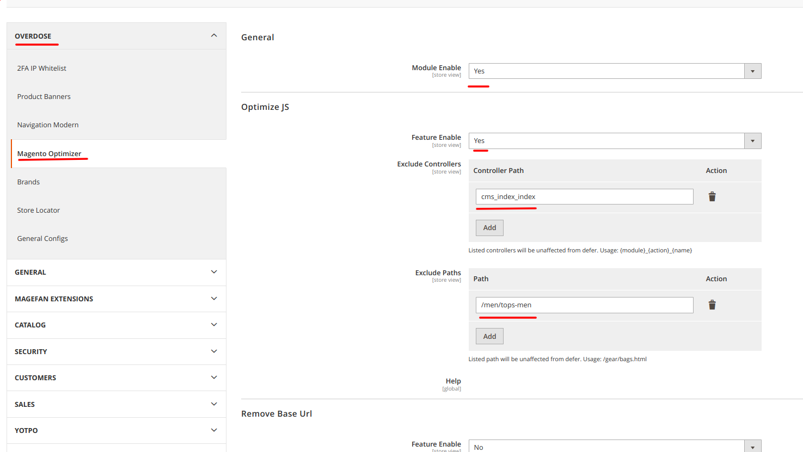

# Overdose Magento2 Optimizer

## Installation
If NOT packagist, add repository first:
```
composer config repositories.overdose/module-magento-optimizer vcs git@github.com:Overdose-Digital/magento2-optimizer.git
```

For all cases
(DISCLAYMER: check version before run this command)
```
composer require overdose/module-magento-optimizer --no-update
composer update overdose/module-magento-optimizer
```

**‼️‼️ Ensure that default magento option `move_script_to_bottom` is disabled ‼️‼️**

## Functionality
### Main features
- Optimizer moves all js script in the bottom of page, can be configured via adding controllers and paths (pages) which will not be affected 
- Remove Base Url from pages, can be configured via adding controllers and paths (pages) which will not be affected
- Features can be turned on separately, or work both at the same time

## Configurations:
- For excluding controller: add in the field `{module}_{action}_{name}`, for example:`cms_index_index`
- For excluding paths: add in the field for example "/gear/bags.html"
## Additional


## Support
Magento 2.0 | Magento 2.1 | Magento 2.2 | Magento 2.3 | Magento 2.4
:---: | :---: | :---: | :---: | :---:
? | ? | ? | ok | ok
